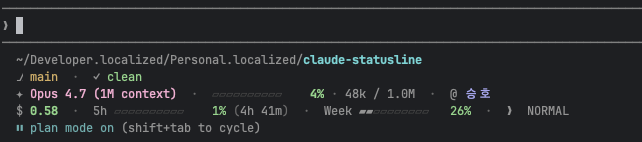
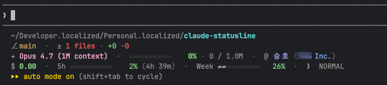

[English](README.md) | **한국어**

# claude-code-statusline

> **흘끗 보면 됩니다.**  
> [Claude Code](https://www.anthropic.com/claude-code)의 한도, 컨텍스트, 계정. 묻지 않아도 늘 같은 자리에 있습니다.

`/usage`, `/context`, `claude auth status`로 작업을 멈추는 대신, 그저 보면 됩니다.

## 미리보기

**개인 계정**



**팀 계정 (경고 포함)**



## 한눈에

- **`5h` 한도**: 사용률 bar, %, 리셋까지 남은 시간. 15분 미만은 `!`로 강조합니다.
- **`Week` 한도**: 사용률 bar, %, 리셋까지 남은 시간 (일/시 단위).
- **`✦` 컨텍스트**: 모델명, bar, %, 토큰 카운트. 50%와 80%에서 색이 바뀌고 90% 초과 시 `!`. 1M 이상은 `1.2M`로 축약합니다.
- **`@` 계정**: 개인은 `@ Name`, 팀은 `@ Name (OrgName)`으로 표시해 여러 계정을 오갈 때 헷갈리지 않습니다.
- **`$` 비용**: 세션 누적. $2와 $5에서 색이 바뀌고 초과 시 `!`로 강조합니다.
- **cwd, `⎇` git, `❯` vim**: 작업 위치, 브랜치와 더티 상태 (`⌥` worktree 포함), vim 모드.

## 설치

정식 런타임은 `statusline.js` (Node ≥18) 입니다. 크로스 플랫폼이고 npm 의존성이
없습니다. 레거시 `statusline.sh`는 회귀 비교용 레퍼런스로 보존되며 향후 릴리스
에서 제거될 예정입니다.

설치 스크립트는 기존 `~/.claude/statusline.{sh,js}`와 `~/.claude/settings.json`을
타임스탬프 백업(`*.bak.<YYYYMMDD-HHMMSS>`)으로 먼저 보존한 뒤 덮어쓰며, 완료
시점에 백업 경로를 출력합니다.

### macOS / Linux / WSL2

```sh
curl -fsSL https://raw.githubusercontent.com/seungho-jeong/claude-code-statusline/main/install.sh | sh
```

### Windows (PowerShell 5.1+)

```powershell
iwr -useb https://raw.githubusercontent.com/seungho-jeong/claude-code-statusline/main/install.ps1 | iex
```

### 수동 설치

`statusline.js`를 `~/.claude/statusline.js`에 (Windows는
`%USERPROFILE%\.claude\statusline.js`) 두고 `~/.claude/settings.json`에 추가:

```json
{
  "statusLine": {
    "type": "command",
    "command": "node ~/.claude/statusline.js",
    "padding": 0
  }
}
```

Windows에서는 명령을 `node %USERPROFILE%\\.claude\\statusline.js`로 바꿉니다.
Windows 10 1809+ 환경의 Windows Terminal + Git for Windows 조합이 지원
대상이며, ANSI 색상을 위해 ConPTY가 필요합니다. 구형 `cmd.exe`는 충돌 없이
실행되지만 SGR escape를 무시하므로 출력이 색 없이 표시됩니다.

### 레거시: shell 런타임

원본 `statusline.sh` (bash + jq + coreutils)는 Node 포트와의 byte 단위 회귀
비교를 위해 저장소에 보존됩니다. macOS / Linux 전용이며, 설치 시 deprecation
경고가 출력됩니다:

```sh
curl -fsSL https://raw.githubusercontent.com/seungho-jeong/claude-code-statusline/main/install.sh | sh -s -- --runner sh
```

## 설정

모든 임계값은 `CCSL_*` 환경변수로 덮어쓸 수 있습니다.

| 변수 | 기본값 | 의미 |
|---|---|---|
| `CCSL_BAR_WIDTH` | `10` | bar 셀 수 |
| `CCSL_CTX_WARN` | `50` | 컨텍스트 % 노랑 임계 |
| `CCSL_CTX_CRIT` | `80` | 컨텍스트 % 빨강 임계 |
| `CCSL_FIRE_THRESHOLD` | `90` | 컨텍스트 `!` 임계 |
| `CCSL_LIMIT_WARN_MIN` | `15` | 5시간 리셋 `!` 임계 (분) |
| `CCSL_COST_WARN` | `2.0` | 비용 노랑 임계 ($) |
| `CCSL_COST_CRIT` | `5.0` | 비용 빨강 임계 ($) |
| `CCSL_GIT_TIMEOUT` | `1` | git 호출 상한 (초) |

예: `CCSL_CTX_WARN=30 claude`

## 동작 원리

- **계정 정체성**은 `~/.claude.json`의 `oauthAccount`를 직접 읽습니다. CLI 호출을 거치지 않으므로 병렬 세션에서도 흔들리지 않습니다. 자동 생성 조직명은 정규식으로 걸러 개인과 팀을 자동 판별합니다.
- **가볍게 동작합니다.** Node 런타임은 `JSON.parse`로 처리하고 `git`만 fork합니다. shell 런타임은 단일 jq 호출과 Unit Separator로 필드를 추출합니다. 두 런타임 모두 CWD별 5초 TTL 파일 캐시로 git 정보를 재사용합니다.
- **누락에 너그럽습니다.** `rate_limits`, `vim.mode`, `~/.claude.json`, `jq` 중 무엇이 없어도 해당 요소만 생략하고 나머지는 그대로 표시합니다.

## 테스트

```sh
./tests/run.sh                          # sh + js 스냅샷 diff (plain)
./tests/run.sh --mode ansi              # ANSI 포함 스냅샷 비교
./tests/run.sh --runner js              # js 런타임만 실행
./tests/run.sh --update                 # 스냅샷 재생성 (sh 기준)
./tests/perf.sh                         # 콜드 스타트 가드: 평균 80ms 미만
./tests/integration-no-git.sh           # git 부재 시 폴백
./tests/integration-no-home.sh          # HOME 미설정/존재하지 않을 때 폴백
./tests/integration-install-backup.sh   # install.sh가 기존 자산을 백업하는지 검증
```

호스트의 git / HOME / 캐시를 건드리지 않도록 임시 디렉토리에 격리되어 실행됩니다.

## 의존성

- **statusline.js (정식)**: Node ≥18. npm 의존성 없음. `git`은 선택 — 없으면 line 2가 `(no git repo)`로 폴백.
- **statusline.sh (레거시)**: `jq`, `git` + macOS/Linux 표준 coreutils.
- **install.sh / install.ps1**: `curl` (또는 Windows의 `Invoke-WebRequest`). `jq`는 선택 — 없으면 settings.json 자동 갱신만 생략됩니다.

## 라이선스

MIT. [LICENSE](LICENSE) 참조.
